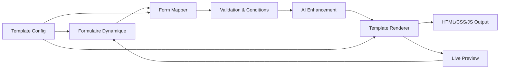

# Architecture pour Templates 100% Dynamiques via Formulaire

## 🎯 Objectif
Transformer les templates statiques en système 100% dynamique où **TOUT** est modifiable via formulaire, avec affichage conditionnel des sections selon les données remplies.

## 📊 Analyse de l'Existant

### Structure Actuelle
- **Templates modulaires** : Classe de base `TemplateModulaireBase` + templates spécifiques
- **Données client** : Interface `ClientFormData` avec ~67 champs
- **Génération multi-pages** : 10-100+ pages générées automatiquement
- **Enrichissement IA** : Services DeepSeek pour amélioration du contenu

### Points Forts à Conserver
✅ Architecture modulaire solide
✅ Système de génération multi-pages
✅ SEO local (service × ville)
✅ Navigation adaptative

### Limitations Actuelles
❌ Données figées dans le code des templates
❌ Pas de rendu conditionnel sophistiqué
❌ Mapping formulaire → template trop rigide
❌ Difficile d'ajouter de nouveaux champs

## 🏗️ Architecture Proposée

### 1. Système de Configuration Dynamique

```typescript
// Template Configuration Schema
interface DynamicTemplateConfig {
  // Métadonnées
  id: string;
  name: string;
  version: string;
  
  // Sections disponibles
  sections: {
    [sectionId: string]: {
      type: 'hero' | 'services' | 'about' | 'testimonials' | 'gallery' | 'team' | 'faq' | 'contact' | 'custom';
      label: string;
      required: boolean;
      minItems?: number;
      maxItems?: number;
      
      // Conditions d'affichage
      displayConditions?: {
        field: string;
        operator: 'exists' | 'equals' | 'contains' | 'greaterThan' | 'lessThan';
        value?: any;
      }[];
      
      // Champs de données
      fields: {
        [fieldId: string]: {
          type: 'text' | 'textarea' | 'number' | 'select' | 'multiselect' | 'image' | 'video' | 'file' | 'boolean' | 'date' | 'color' | 'array';
          label: string;
          placeholder?: string;
          required?: boolean;
          validation?: any;
          aiEnhanceable?: boolean; // Si le champ peut être amélioré par IA
          defaultValue?: any;
        }
      };
      
      // Variantes visuelles
      variants: {
        [variantId: string]: {
          name: string;
          preview?: string;
          settings: Record<string, any>;
        }
      };
    }
  };
  
  // Règles de composition
  compositionRules: {
    minSections: number;
    maxSections: number;
    requiredSections: string[];
    sectionOrder?: string[];
  };
  
  // Styles globaux
  globalStyles: {
    themes: Record<string, ThemeConfig>;
    customizable: boolean;
  };
}
```

### 2. Système de Mapping Formulaire → Template

```typescript
// Dynamic Form Data Mapper
class DynamicFormMapper {
  // Map les données du formulaire vers la structure du template
  mapFormToTemplate(
    formData: Record<string, any>,
    templateConfig: DynamicTemplateConfig
  ): MappedTemplateData {
    const mappedSections: MappedSection[] = [];
    
    // Pour chaque section du template
    for (const [sectionId, sectionConfig] of Object.entries(templateConfig.sections)) {
      // Vérifier les conditions d'affichage
      if (this.shouldDisplaySection(formData, sectionConfig.displayConditions)) {
        // Mapper les champs
        const sectionData = this.mapSectionFields(
          formData,
          sectionConfig.fields
        );
        
        // Si la section a du contenu, l'ajouter
        if (this.sectionHasContent(sectionData, sectionConfig)) {
          mappedSections.push({
            id: sectionId,
            type: sectionConfig.type,
            data: sectionData,
            variant: this.selectVariant(formData, sectionConfig.variants)
          });
        }
      }
    }
    
    return {
      sections: mappedSections,
      theme: this.selectTheme(formData, templateConfig.globalStyles),
      metadata: this.extractMetadata(formData)
    };
  }
  
  // Vérifier si une section doit être affichée
  private shouldDisplaySection(
    formData: Record<string, any>,
    conditions?: DisplayCondition[]
  ): boolean {
    if (!conditions || conditions.length === 0) return true;
    
    return conditions.every(condition => {
      const fieldValue = this.getNestedValue(formData, condition.field);
      
      switch (condition.operator) {
        case 'exists':
          return fieldValue !== undefined && fieldValue !== null && fieldValue !== '';
        case 'equals':
          return fieldValue === condition.value;
        case 'contains':
          return Array.isArray(fieldValue) 
            ? fieldValue.includes(condition.value)
            : String(fieldValue).includes(condition.value);
        case 'greaterThan':
          return Number(fieldValue) > Number(condition.value);
        case 'lessThan':
          return Number(fieldValue) < Number(condition.value);
        default:
          return true;
      }
    });
  }
  
  // Vérifier si une section a du contenu valide
  private sectionHasContent(
    data: Record<string, any>,
    config: SectionConfig
  ): boolean {
    // Pour les sections avec items (testimonials, services, etc.)
    if (config.type === 'testimonials' || config.type === 'services' || config.type === 'gallery') {
      const items = data.items || [];
      return items.length >= (config.minItems || 0);
    }
    
    // Pour les autres sections, vérifier les champs requis
    for (const [fieldId, fieldConfig] of Object.entries(config.fields)) {
      if (fieldConfig.required && !data[fieldId]) {
        return false;
      }
    }
    
    // Vérifier qu'au moins un champ non-requis a du contenu
    return Object.values(data).some(value => 
      value !== undefined && value !== null && value !== ''
    );
  }
}
```

### 3. Système de Rendu Conditionnel

```typescript
// Dynamic Template Renderer
class DynamicTemplateRenderer {
  private aiEnhancer: AIContentEnhancer;
  
  constructor() {
    this.aiEnhancer = new AIContentEnhancer();
  }
  
  // Rendre un template complet
  async renderTemplate(
    mappedData: MappedTemplateData,
    options: RenderOptions = {}
  ): Promise<RenderedTemplate> {
    // Améliorer le contenu avec IA si demandé
    if (options.enhanceWithAI) {
      mappedData = await this.aiEnhancer.enhance(mappedData);
    }
    
    // Générer le HTML pour chaque section
    const sections = await Promise.all(
      mappedData.sections.map(section => 
        this.renderSection(section, mappedData.theme)
      )
    );
    
    // Assembler le template final
    return {
      html: this.assembleHTML(sections, mappedData),
      css: this.generateCSS(mappedData.theme),
      js: this.generateJS(mappedData.sections),
      metadata: mappedData.metadata
    };
  }
  
  // Rendre une section individuelle
  private async renderSection(
    section: MappedSection,
    theme: ThemeConfig
  ): Promise<string> {
    // Sélectionner le renderer approprié
    const renderer = this.getRenderer(section.type, section.variant);
    
    // Appliquer les transformations de données
    const transformedData = this.transformData(section.data, section.type);
    
    // Générer le HTML
    return renderer.render(transformedData, theme);
  }
  
  // Système de renderers modulaires
  private getRenderer(type: string, variant: string): SectionRenderer {
    const renderers = {
      hero: {
        default: new HeroDefaultRenderer(),
        minimal: new HeroMinimalRenderer(),
        video: new HeroVideoRenderer(),
        parallax: new HeroParallaxRenderer()
      },
      services: {
        default: new ServicesGridRenderer(),
        carousel: new ServicesCarouselRenderer(),
        tabs: new ServicesTabsRenderer(),
        accordion: new ServicesAccordionRenderer()
      },
      testimonials: {
        default: new TestimonialsSliderRenderer(),
        grid: new TestimonialsGridRenderer(),
        masonry: new TestimonialsMasonryRenderer()
      }
      // ... autres types
    };
    
    return renderers[type]?.[variant] || renderers[type]?.default;
  }
}
```

### 4. Enrichissement IA Intelligent

```typescript
// AI Content Enhancer
class AIContentEnhancer {
  // Améliorer le contenu de manière contextuelle
  async enhance(data: MappedTemplateData): Promise<MappedTemplateData> {
    const enhancedSections = await Promise.all(
      data.sections.map(async section => {
        // Identifier les champs à améliorer
        const fieldsToEnhance = this.getEnhanceableFields(section);
        
        if (fieldsToEnhance.length === 0) return section;
        
        // Générer le contexte pour l'IA
        const context = this.buildContext(data, section);
        
        // Améliorer chaque champ
        const enhancements = await this.generateEnhancements(
          fieldsToEnhance,
          context
        );
        
        // Appliquer les améliorations
        return this.applyEnhancements(section, enhancements);
      })
    );
    
    return {
      ...data,
      sections: enhancedSections
    };
  }
  
  // Générer des améliorations contextuelles
  private async generateEnhancements(
    fields: FieldToEnhance[],
    context: EnhancementContext
  ): Promise<Enhancement[]> {
    const prompts = fields.map(field => ({
      fieldId: field.id,
      prompt: this.buildPrompt(field, context),
      constraints: field.constraints
    }));
    
    // Appel à l'IA (DeepSeek, Claude, etc.)
    const responses = await this.aiService.batchGenerate(prompts);
    
    return responses.map((response, index) => ({
      fieldId: fields[index].id,
      originalValue: fields[index].value,
      enhancedValue: response.content,
      confidence: response.confidence
    }));
  }
}
```

### 5. Système de Formulaire Dynamique

```typescript
// Dynamic Form Builder
class DynamicFormBuilder {
  // Générer un formulaire basé sur la config du template
  buildForm(templateConfig: DynamicTemplateConfig): FormSchema {
    const formSections: FormSection[] = [];
    
    for (const [sectionId, sectionConfig] of Object.entries(templateConfig.sections)) {
      const formFields = this.buildFormFields(sectionConfig.fields);
      
      formSections.push({
        id: sectionId,
        title: sectionConfig.label,
        description: this.getSectionDescription(sectionConfig),
        fields: formFields,
        collapsible: !sectionConfig.required,
        defaultCollapsed: !sectionConfig.required,
        validationRules: this.buildValidationRules(sectionConfig)
      });
    }
    
    return {
      sections: formSections,
      navigation: this.buildNavigation(formSections),
      validation: this.buildGlobalValidation(templateConfig)
    };
  }
  
  // Interface React pour le formulaire
  renderDynamicForm(schema: FormSchema): JSX.Element {
    return (
      <DynamicForm
        schema={schema}
        onFieldChange={this.handleFieldChange}
        onSectionToggle={this.handleSectionToggle}
        preview={this.generateLivePreview}
        aiAssist={this.provideAIAssistance}
      />
    );
  }
}
```

## 🔄 Flux de Données



## 📋 Plan d'Implémentation

### Phase 1: Infrastructure de Base
1. Créer le système de configuration des templates
2. Implémenter le mapper formulaire → template
3. Développer les renderers de base pour chaque type de section

### Phase 2: Logique Conditionnelle
1. Système de conditions d'affichage
2. Validation dynamique des sections
3. Gestion des dépendances entre champs

### Phase 3: Enrichissement IA
1. Service d'amélioration contextuelle
2. Génération de contenu manquant
3. Optimisation SEO automatique

### Phase 4: Interface Utilisateur
1. Formulaire dynamique React
2. Preview en temps réel
3. Assistant IA intégré

### Phase 5: Optimisations
1. Cache des rendus
2. Lazy loading des sections
3. Optimisation des performances

## 💡 Avantages de cette Architecture

### Flexibilité Maximale
- ✅ Ajout facile de nouveaux champs sans toucher au code
- ✅ Sections conditionnelles selon les données
- ✅ Variantes visuelles multiples par section

### Maintenabilité
- ✅ Séparation claire données/présentation
- ✅ Configuration centralisée
- ✅ Renderers modulaires réutilisables

### Expérience Utilisateur
- ✅ Formulaire adaptatif selon les besoins
- ✅ Preview en temps réel
- ✅ Assistance IA contextuelle

### Scalabilité
- ✅ Support de nouveaux types de business
- ✅ Multiples templates par configuration
- ✅ Personnalisation infinie

## 🚀 Prochaines Étapes

1. **Validation du concept** avec un template pilote
2. **Création du schema JSON** pour la configuration
3. **Développement du mapper** et des conditions
4. **Tests avec données réelles** existantes
5. **Migration progressive** des templates actuels

Cette architecture permet une **personnalisation totale** tout en gardant la **robustesse** du système actuel et en ajoutant des capacités d'**adaptation intelligente** via IA.