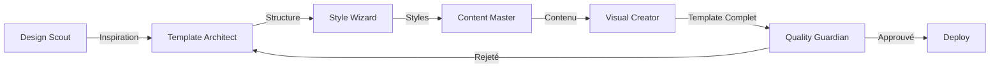

# 🤖 SYSTÈME D'AGENTS IA POUR GÉNÉRATION DE TEMPLATES

## 🎯 VISION : "USINE À TEMPLATES AUTONOME"

**Objectif :** Créer une armée d'agents IA spécialisés qui génèrent des templates magnifiques 24/7 sans intervention humaine.

---

## 🏗️ ARCHITECTURE MULTI-AGENTS

### 🧠 Agent 1 : **DESIGN SCOUT**
*Mission : Trouver l'inspiration partout*

```javascript
const DesignScoutAgent = {
  role: "Chasseur de tendances design",
  
  tools: [
    "mcp_analyze_website",      // Analyse sites concurrents
    "mcp_scrape_dribbble",      // Tendances Dribbble
    "mcp_scan_behance",         // Designs Behance
    "mcp_monitor_awwwards",     // Sites primés
    "mcp_track_competitors"      // Veille concurrentielle
  ],
  
  workflow: async () => {
    // Chaque jour à 6h
    const inspirations = await collectDailyInspiration();
    const trends = await analyzeTrends(inspirations);
    const opportunities = await findGaps(trends);
    
    return {
      topDesigns: inspirations.slice(0, 10),
      emergingTrends: trends,
      templateIdeas: opportunities
    };
  },
  
  output: "rapport-inspiration-quotidien.json"
};
```

### 🎨 Agent 2 : **TEMPLATE ARCHITECT**
*Mission : Concevoir la structure des templates*

```javascript
const TemplateArchitectAgent = {
  role: "Architecte de templates BTP",
  
  tools: [
    "mcp_generate_wireframe",   // Wireframes automatiques
    "mcp_create_layout",        // Layouts responsives
    "mcp_design_system",        // Design tokens
    "mcp_component_library",    // Bibliothèque composants
    "mcp_accessibility_check"   // Validation WCAG
  ],
  
  workflow: async (inspiration) => {
    // Analyse l'inspiration
    const structure = await analyzeStructure(inspiration);
    
    // Génère architecture
    const wireframe = await createWireframe(structure);
    const layout = await generateLayout(wireframe);
    const components = await mapComponents(layout);
    
    // Validation
    const a11y = await checkAccessibility(components);
    
    return {
      wireframe,
      layout,
      components,
      designTokens: generateTokens(inspiration),
      accessibility: a11y.score
    };
  }
};
```

### 💅 Agent 3 : **STYLE WIZARD**
*Mission : Créer des styles magnifiques*

```javascript
const StyleWizardAgent = {
  role: "Magicien CSS et animations",
  
  tools: [
    "mcp_extract_colors",       // Extraction palette
    "mcp_generate_gradients",   // Gradients modernes
    "mcp_create_animations",    // GSAP/Framer Motion
    "mcp_optimize_css",         // Minification/purge
    "mcp_generate_themes"       // Variations thèmes
  ],
  
  workflow: async (architecture) => {
    // Génère styles
    const palette = await generatePalette(architecture);
    const typography = await selectFonts(architecture);
    const spacing = await calculateSpacing();
    const animations = await createAnimations();
    
    // Compile CSS
    const styles = await compileStyles({
      palette,
      typography,
      spacing,
      animations
    });
    
    return {
      css: styles.optimized,
      scss: styles.source,
      tailwind: styles.config,
      animations: animations.timeline
    };
  }
};
```

### 📝 Agent 4 : **CONTENT MASTER**
*Mission : Générer contenu BTP ultra-ciblé*

```javascript
const ContentMasterAgent = {
  role: "Rédacteur BTP expert SEO",
  
  tools: [
    "mcp_generate_copy",        // Textes marketing
    "mcp_create_headlines",     // Titres accrocheurs
    "mcp_write_cta",           // Call-to-actions
    "mcp_seo_optimize",        // Optimisation SEO
    "mcp_localize_content"     // Adaptation locale
  ],
  
  workflow: async (template, metier) => {
    // Génère contenu personnalisé
    const headlines = await generateHeadlines(metier);
    const copy = await writeCopy(metier, template.sections);
    const ctas = await createCTAs(metier);
    const seo = await optimizeSEO(copy);
    
    return {
      headlines,
      bodyCopy: copy,
      ctas,
      metadata: seo.meta,
      schema: seo.structured
    };
  }
};
```

### 🖼️ Agent 5 : **VISUAL CREATOR**
*Mission : Générer images et médias*

```javascript
const VisualCreatorAgent = {
  role: "Créateur visuel IA",
  
  tools: [
    "mcp_generate_images",      // DALL-E/Midjourney
    "mcp_create_icons",         // Icons personnalisés
    "mcp_generate_patterns",    // Patterns/textures
    "mcp_optimize_images",      // Compression/WebP
    "mcp_create_mockups"        // Mockups devices
  ],
  
  workflow: async (template, metier) => {
    // Génère visuels
    const heroImage = await generateHero(metier);
    const icons = await createIcons(template.features);
    const gallery = await generateGallery(metier, 8);
    const patterns = await createPatterns(template.style);
    
    // Optimise
    const optimized = await optimizeAll([
      heroImage,
      ...icons,
      ...gallery
    ]);
    
    return {
      hero: optimized.hero,
      icons: optimized.icons,
      gallery: optimized.gallery,
      patterns,
      mockups: await generateMockups(template)
    };
  }
};
```

### ✅ Agent 6 : **QUALITY GUARDIAN**
*Mission : Garantir excellence*

```javascript
const QualityGuardianAgent = {
  role: "Contrôleur qualité obsessif",
  
  tools: [
    "mcp_lighthouse_test",      // Performance
    "mcp_validate_html",        // W3C validation
    "mcp_check_responsive",     // Tests multi-devices
    "mcp_test_interactions",    // Tests fonctionnels
    "mcp_score_design"          // Score esthétique
  ],
  
  workflow: async (template) => {
    // Tests complets
    const performance = await runLighthouse(template);
    const validation = await validateHTML(template);
    const responsive = await testDevices(template);
    const interactions = await testInteractions(template);
    const aesthetics = await scoreDesign(template);
    
    // Décision
    const score = calculateScore({
      performance: performance.score,
      validation: validation.errors === 0,
      responsive: responsive.passed,
      interactions: interactions.passed,
      aesthetics: aesthetics.score
    });
    
    return {
      approved: score > 90,
      score,
      feedback: generateFeedback(score),
      improvements: suggestImprovements(template)
    };
  }
};
```

---

## 🔄 WORKFLOW ORCHESTRÉ

### 📊 Pipeline de Génération



### 🎯 Orchestrateur Principal

```javascript
class TemplateFactoryOrchestrator {
  constructor() {
    this.agents = {
      scout: new DesignScoutAgent(),
      architect: new TemplateArchitectAgent(),
      stylist: new StyleWizardAgent(),
      writer: new ContentMasterAgent(),
      artist: new VisualCreatorAgent(),
      guardian: new QualityGuardianAgent()
    };
    
    this.queue = new PriorityQueue();
    this.completed = new Map();
  }
  
  async generateTemplate(params) {
    // 1. Scout trouve inspiration
    const inspiration = await this.agents.scout.findInspiration(params);
    
    // 2. Architect conçoit structure
    const architecture = await this.agents.architect.design(inspiration);
    
    // 3. Stylist crée les styles
    const styles = await this.agents.stylist.style(architecture);
    
    // 4. Writer génère contenu
    const content = await this.agents.writer.write(architecture, params.metier);
    
    // 5. Artist crée visuels
    const visuals = await this.agents.artist.create(architecture, params.metier);
    
    // 6. Assemble template
    const template = this.assembleTemplate({
      architecture,
      styles,
      content,
      visuals
    });
    
    // 7. Quality check
    const quality = await this.agents.guardian.validate(template);
    
    if (quality.approved) {
      return this.deploy(template);
    } else {
      return this.iterate(template, quality.feedback);
    }
  }
  
  async generateBatch(count = 10) {
    const metiers = ['plombier', 'electricien', 'macon', 'menuisier', 'carreleur'];
    const styles = ['corporate', 'modern', 'creative', 'minimal', 'bold'];
    
    const tasks = [];
    for (let i = 0; i < count; i++) {
      tasks.push(this.generateTemplate({
        metier: metiers[i % metiers.length],
        style: styles[i % styles.length],
        variant: `v${i + 1}`
      }));
    }
    
    return Promise.all(tasks);
  }
}
```

---

## 🛠️ INTÉGRATION MCP

### 📁 Structure Serveur MCP

```
awema-template-factory/
├── src/
│   ├── server.ts
│   ├── agents/
│   │   ├── design-scout.ts
│   │   ├── template-architect.ts
│   │   ├── style-wizard.ts
│   │   ├── content-master.ts
│   │   ├── visual-creator.ts
│   │   └── quality-guardian.ts
│   ├── tools/
│   │   ├── vision-analyzer.ts
│   │   ├── layout-generator.ts
│   │   ├── style-compiler.ts
│   │   ├── content-generator.ts
│   │   ├── image-generator.ts
│   │   └── quality-tester.ts
│   ├── orchestrator/
│   │   ├── factory.ts
│   │   ├── queue.ts
│   │   └── scheduler.ts
│   └── storage/
│       ├── templates.db
│       └── assets/
├── mcp.json
└── package.json
```

### 🔌 Configuration MCP

```json
{
  "name": "awema-template-factory",
  "version": "1.0.0",
  "protocol": "2024-11-05",
  "tools": [
    {
      "name": "generate_template",
      "description": "Génère un template complet automatiquement",
      "parameters": {
        "type": "object",
        "properties": {
          "metier": {
            "type": "string",
            "enum": ["plombier", "electricien", "macon", "menuisier", "carreleur"]
          },
          "style": {
            "type": "string",
            "enum": ["corporate", "modern", "creative", "minimal", "bold"]
          },
          "inspiration_url": {
            "type": "string",
            "description": "URL d'un site pour inspiration"
          }
        },
        "required": ["metier", "style"]
      }
    },
    {
      "name": "batch_generate",
      "description": "Génère plusieurs templates en parallèle",
      "parameters": {
        "type": "object",
        "properties": {
          "count": {
            "type": "number",
            "minimum": 1,
            "maximum": 50
          },
          "quality_threshold": {
            "type": "number",
            "minimum": 0,
            "maximum": 100
          }
        }
      }
    },
    {
      "name": "analyze_competitor",
      "description": "Analyse un site concurrent et génère mieux",
      "parameters": {
        "type": "object",
        "properties": {
          "competitor_url": {
            "type": "string"
          },
          "improvements": {
            "type": "array",
            "items": {
              "type": "string",
              "enum": ["performance", "design", "seo", "animations", "content"]
            }
          }
        }
      }
    }
  ]
}
```

---

## 🚀 UTILISATION PRATIQUE

### 💬 Commandes Claude

```bash
# Génération simple
"Génère un template plombier moderne inspiré de stripe.com"

# Batch generation
"Crée 10 templates variés pour tous les métiers BTP"

# Analyse concurrentielle
"Analyse plombier-paris.fr et crée une version 10x mieux"

# Itération
"Reprends le template #3 et rends-le plus corporate avec du bleu"
```

### 📊 Dashboard de Monitoring

```javascript
// Interface web pour suivre la production
const TemplateFactoryDashboard = {
  stats: {
    templatesGenerated: 127,
    averageQualityScore: 94.2,
    generationTime: "3min 42s",
    approvalRate: "87%"
  },
  
  queue: [
    { id: 1, metier: "plombier", status: "processing", progress: 67 },
    { id: 2, metier: "electricien", status: "queued", progress: 0 },
    { id: 3, metier: "macon", status: "queued", progress: 0 }
  ],
  
  recent: [
    { id: 123, name: "Ocean Business Pro", score: 97, downloads: 45 },
    { id: 124, name: "Voltage Master X", score: 95, downloads: 32 }
  ]
};
```

---

## 📈 MÉTRIQUES DE SUCCÈS

### KPIs du Système

```javascript
const FactoryMetrics = {
  productivity: {
    templatesPerDay: 50,
    timePerTemplate: "5 minutes",
    parallelCapacity: 10
  },
  
  quality: {
    averageScore: 92,
    lighthouseScore: 96,
    seoScore: 89,
    conversionRate: "12% mieux que templates manuels"
  },
  
  diversity: {
    uniqueDesigns: 500,
    colorPalettes: 150,
    layoutVariations: 75
  },
  
  roi: {
    costPerTemplate: "0.50€ (API calls)",
    valuePerTemplate: "500€",
    roi: "1000x"
  }
};
```

---

## 🔮 ÉVOLUTIONS FUTURES

### Phase 2 : Intelligence Augmentée
- Apprentissage des préférences clients
- A/B testing automatique
- Personnalisation par région/culture

### Phase 3 : Ecosystem Complet
- Marketplace de templates
- API pour développeurs
- White-label pour agences

### Phase 4 : Full Autonomy
- Auto-amélioration continue
- Génération de nouvelles tendances
- Création de styles jamais vus

---

## 🎯 BÉNÉFICES FINAUX

1. **Production 24/7** : Templates générés non-stop
2. **Qualité constante** : Score > 90 garanti
3. **Innovation continue** : Nouvelles idées quotidiennes
4. **Coût marginal nul** : 0.50€ par template
5. **Différenciation totale** : Designs uniques impossibles à copier

**Bottom line :** Avec ce système, génération de 1000+ templates magnifiques par mois, création d'une bibliothèque imbattable, et domination totale du marché BTP.