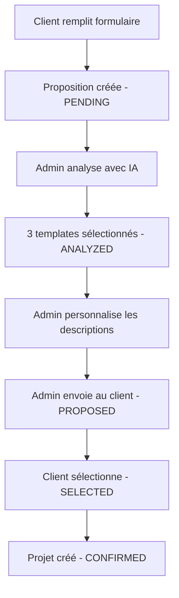

# 🧪 Guide de test du workflow de sélection de templates

## 📋 Vue d'ensemble du workflow



## 🚀 Comment tester

### 1. Créer des données de test

```bash
# Créer un client test avec proposition
node scripts/test-template-workflow.js
```

Cela va créer :
- Un client : "Plomberie Dupont & Fils"
- Une proposition en attente d'analyse
- Afficher les URLs à tester

### 2. Interface Admin

**URL:** http://localhost:3000/admin/proposals

**Étapes à suivre :**

1. **Voir la liste des propositions**
   - La proposition "Plomberie Dupont & Fils" apparaît avec badge "En attente d'analyse"

2. **Cliquer sur la proposition**
   - Voir les infos du formulaire
   - Bouton "Analyser avec IA" disponible

3. **Lancer l'analyse IA**
   - Cliquer sur "Analyser avec IA"
   - L'IA sélectionne 3 templates
   - Analyse du profil client visible
   - Suggestions de personnalisation

4. **Personnaliser chaque option**
   - Onglets Option 1, 2, 3
   - Pour chaque option, ajouter :
     - Notes personnalisées (ex: "Ce design moderne met parfaitement en valeur...")
     - Points forts à souligner
   - Message global personnalisé

5. **Envoyer au client**
   - Cliquer sur "Envoyer au client"
   - Statut passe à "Proposé"

### 3. Interface Client

**URL:** http://localhost:3000/client/proposals/[ID_PROPOSITION]

**Ce que le client voit :**
- Message personnalisé de bienvenue
- 3 options de design présentées élégamment
- Pour chaque option :
  - Nom et description personnalisée (par l'admin)
  - Points forts mis en avant
  - Aperçu visuel de la structure
  - Palette de couleurs
- Bouton de sélection radio
- Bouton "Valider mon choix"

**Le client NE voit PAS :**
- Les scores de matching
- L'analyse IA
- Les raisons techniques
- Aucune mention de "template"

### 4. Vérifier dans la base de données

```bash
# Ouvrir Prisma Studio
npx prisma studio
```

- Table `template_proposals`
- Vérifier les changements de statut
- Voir les données JSON stockées

## 🧹 Nettoyer après les tests

```bash
# Supprimer les données de test
node scripts/test-template-workflow.js cleanup
```

## 📊 États de la proposition

| Statut | Description | Actions disponibles |
|--------|-------------|-------------------|
| PENDING | Formulaire soumis | Analyser avec IA |
| ANALYZED | IA a sélectionné 3 templates | Personnaliser |
| CUSTOMIZING | Admin personnalise | Sauvegarder, Envoyer |
| PROPOSED | Envoyé au client | Attendre sélection |
| SELECTED | Client a choisi | Créer le projet |
| CONFIRMED | Projet démarré | - |

## 🎨 Exemples de personnalisation

### Message global
```
Bonjour M. Dupont,

Suite à notre échange et l'analyse approfondie de vos besoins pour Plomberie Dupont & Fils, 
j'ai le plaisir de vous présenter 3 propositions de sites web entièrement conçues pour 
votre activité de plomberie avec service d'urgence 24/7.

Chaque design a été pensé pour mettre en valeur votre expertise de plus de 18 ans 
et faciliter la prise de contact en urgence.
```

### Notes pour Option 1
```
Ce design moderne et épuré met l'accent sur votre disponibilité 24/7 avec un bouton 
d'appel d'urgence toujours visible. Les couleurs bleues inspirent confiance et 
professionnalisme, parfait pour rassurer vos clients en situation d'urgence.
```

### Points forts à souligner
- ✓ Bouton d'urgence flottant sur toutes les pages
- ✓ Galerie avant/après de vos réalisations
- ✓ Témoignages clients vérifiés
- ✓ Carte interactive de vos zones d'intervention

## 🔧 Dépannage

**La proposition n'apparaît pas dans l'admin ?**
- Vérifier que le client existe dans la DB
- Vérifier le statut de la proposition

**L'analyse IA échoue ?**
- Vérifier que les templates sont bien créés (265 templates)
- Sinon, relancer : `node scripts/generate-ultra-templates.js`

**Le client ne peut pas voir la proposition ?**
- Vérifier que le statut est bien "PROPOSED"
- Vérifier l'URL avec le bon ID

## 📌 Points importants

1. **Illusion du sur-mesure** : Ne jamais mentionner "template" côté client
2. **Personnalisation** : Toujours adapter le message au métier du client
3. **Timing** : Attendre un peu avant d'envoyer (paraître réaliste)
4. **Qualité** : Les descriptions doivent vraiment correspondre au client